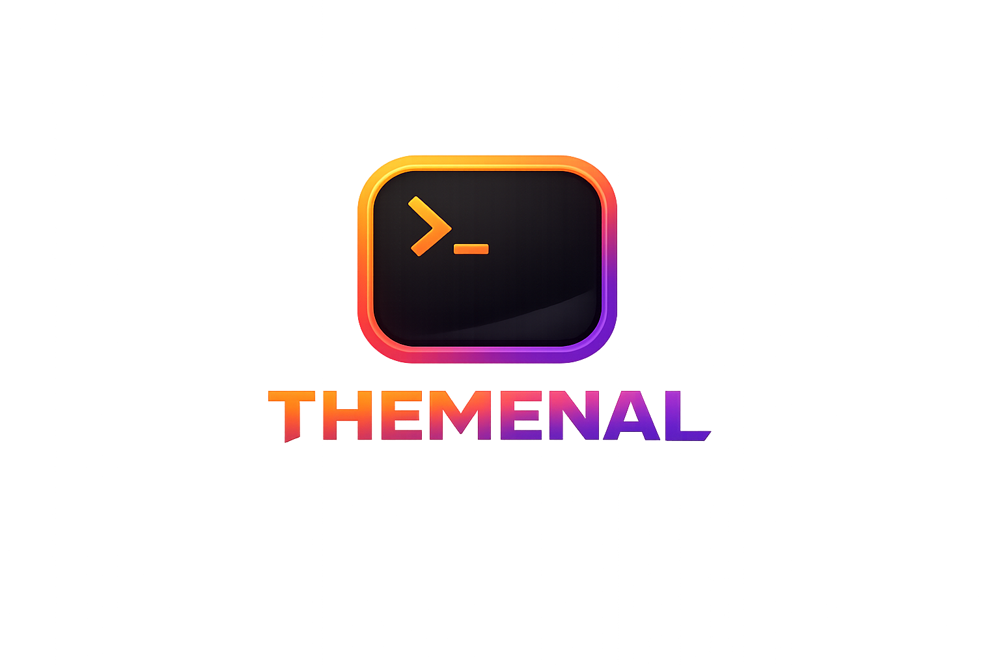

# Themenal

<header style="display: flex; justify-content: center;">
   
</header>

**Themenal** is a beautiful and easy-to-use terminal theme manager for Debian/Ubuntu Linux systems. It allows you to apply, preview, and create custom color themes for your terminal with just a few commands.


## ✨ Features

- 🎨 **Easy Theme Management**: Apply, preview, and list themes effortlessly
- 🔄 **Automatic Terminal Detection**: Detects and configures your terminal emulator
- 📦 **Built-in Themes**: Comes with popular themes (Dracula, Monokai, Nord, Solarized Dark)
- 🎯 **Current Theme Tracking**: Know which theme is currently active
- 🛠️ **Theme Generator**: Create your own custom themes interactively
- 💻 **GNOME Terminal Support**: Full support for GNOME Terminal (more coming soon!)

## 📋 Prerequisites

- **Operating System**: Debian, Ubuntu, or derivative distributions
- **Terminal**: GNOME Terminal (currently supported)
- **Node.js**: Version 14 or higher
- **npm**: Comes with Node.js

## 🚀 Installation

### Option 1: Debian/Ubuntu Package (.deb) - Recommended

The easiest way to install Themenal on Debian or Ubuntu systems is using the provided `.deb` package. This will install the `themenal` command globally.

1. **Download** the latest `themenal_*.deb` from the [Releases](https://github.com/Gabrielsoac/therminal/releases) page.
2. **Install** it using `dpkg` or `apt`:

```bash
sudo dpkg -i themenal_1.0.0_amd64.deb
sudo apt install -f
```

---

### Option 2: For Contributors (Source)

If you want to contribute new themes or features, install from source:

1. **Clone the repository**:
   ```bash
   git clone https://github.com/Gabrielsoac/therminal.git
   cd therminal
   ```

2. **Install dependencies**:
   ```bash
   npm install
   ```

3. **Build and test**:
   ```bash
   npm run build
   themenal list
   ```

## 📖 Usage

### View Current Theme

Display the currently active theme:

```bash
themenal current
```

### List Available Themes

See all available themes:

```bash
themenal list
```

The currently active theme will be marked with a `►` indicator.

### Preview a Theme

Preview a theme's colors before applying:

```bash
themenal preview dracula
```

### Apply a Theme

Apply a theme to your terminal:

```bash
themenal apply dracula
```

After applying, open a new terminal window to see the changes.

### Generate a Custom Theme

Create your own theme interactively:

```bash
themenal generate
```

Follow the prompts to input colors for each component.

## 🎨 Available Themes

Themenal comes with these beautiful pre-installed themes:

- **Dracula** - A dark theme with vibrant colors
- **Monokai** - The classic Monokai color scheme
- **Nord** - An arctic, north-bluish color palette
- **Solarized Dark** - Precision colors for machines and people

## 🤝 Contributing

We welcome contributions! Whether you want to add new themes, support for more terminals, or fix bugs, your help is appreciated.

### Running the Project Locally

1. **Clone the repository**:
   ```bash
   git clone https://github.com/Gabrielsoac/therminal.git
   cd therminal
   ```

2. **Install dependencies**:
   ```bash
   npm install
   ```

3. **Run in development mode**:
   ```bash
   npm run dev
   ```

4. **Build the project**:
   ```bash
   npm run build
   ```

5. **Test locally**:
   ```bash
   npm link
   themenal list
   ```

### Creating a New Theme

Want to add a new theme to Themenal? It's easy!

1. **Create a YAML file** in `src/themes/`:
   ```bash
   touch src/themes/my-theme.yml
   ```

2. **Define your theme** following this structure:
   ```yaml
   background: "#282a36"
   foreground: "#f8f8f2"
   black: "#21222c"
   red: "#ff5555"
   green: "#50fa7b"
   yellow: "#f1fa8c"
   blue: "#bd93f9"
   magenta: "#ff79c6"
   cyan: "#8be9fd"
   white: "#f8f8f2"
   brightBlack: "#6272a4"
   brightRed: "#ff6e6e"
   brightGreen: "#69ff94"
   brightYellow: "#ffffa5"
   brightBlue: "#d6acff"
   brightMagenta: "#ff92df"
   brightCyan: "#a4ffff"
   brightWhite: "#ffffff"
   ```

3. **Test your theme**:
   ```bash
   npm run build
   themenal preview my-theme
   themenal apply my-theme
   ```

4. **Submit a Pull Request**:
   - Fork the repository
   - Create a new branch: `git checkout -b add-my-theme`
   - Commit your changes: `git commit -am 'Add my-theme'`
   - Push to the branch: `git push origin add-my-theme`
   - Open a Pull Request

See [CONTRIBUTING.md](CONTRIBUTING.md) for more detailed guidelines.

## 🛠️ Development

### Project Structure

```
therminal/
├── src/
│   ├── cli/
│   │   ├── commands/      # CLI command implementations
│   │   └── index.ts       # CLI entry point
│   ├── interfaces/        # TypeScript interfaces
│   ├── services/          # Core services (theme loader, config, etc.)
│   └── themes/            # Theme YAML files
├── dist/                  # Compiled JavaScript (generated)
├── bin/
│   └── themenal          # Executable script
└── package.json
```

### Available Scripts

- `npm run dev` - Run in development mode with tsx
- `npm run build` - Compile TypeScript and copy themes
- `npm link` - Install globally for testing

## 📝 License

This project is licensed under the MIT License - see the [LICENSE](LICENSE) file for details.

## 👤 Author

**Gabriel Soares**

- GitHub: [@Gabrielsoac](https://github.com/Gabrielsoac)

## 🐛 Issues

Found a bug or have a feature request? Please open an issue on [GitHub Issues](https://github.com/Gabrielsoac/therminal/issues).

## ⭐ Show your support

Give a ⭐️ if this project helped you!

---

Made with ❤️ for the dev community
